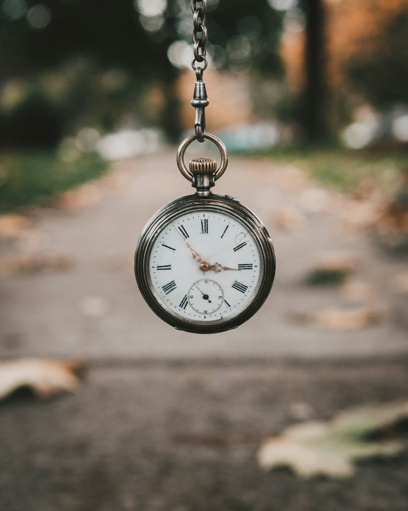

<Callout type="warning">

                            "This thing all things devours;  
                            Birds, beasts, trees, flowers;  
                            Gnaws iron, bites steel;  
                            Grinds hard stones to meal;  
                            Slays king, ruins town,  
                            And beats mountain down."

                            ― J.R.R. Tolkien, The Hobbit

</Callout>

# Time Involves Itself With Everything

No matter where a person is born, how they are raised, or what their ideas are, 
one thing that they all share is the relation to time. Once a person realizes or even gives the "time"
of day to think about this idea of time I believe something in thier mind awakens.

The actual concept of time is very confusing and simple at the same time. I will explain my
idea of though of time in hopes to share my concept of time and ease the negative thoughts that
come with it.

# Do You Actually Have Time?

One thing that I hear many people say is that they either have or do not have time. I do not believe 
anyone has time. No one can acquire more time nor lose it. As soon a person comes into this world the
experation is inevitable. To aquire more time would be to extend the experation date. The only way to 
maybe increase or decrease this is by health. Although I do not believe this is what is implied when others
say they do not have time.

I'm sure that when a person says they wish they had more time, I think they are implying that they did the 
the things that they wanted more. Meaning, they spent their "time" doing and being a person that achieves 
the actions that they wanted during their "moments" they have to spend.

### "Everybody has the same amount of time during the day"

I see this quote everywhere and what sticks out to me is that no one has more or less time than anyone else
in the world. Taking this further, what is the difference between those who do not want more time and those that do?
It comes down to whether or not a person regrets what they have done or not have done.

# Measurement of Time

When researching the measurement of time there is not a universally agreed on rule. Some believe that time is a illusion,
 other's believe that time is an actually unit. We all know of the clock and that is what many of us use to 
 keep "track" of our time. Before the clock there was the idea of the sun and moon as keeping track of "time". Then the upgrade
 came to and the water clock was used. Which then lead us to the mechanical clock.

