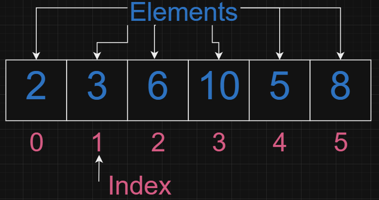

# Introduction
Arrays are fundamental in computer science, and understanding them is crucial for anyone preparing for coding interviews. They form the basis for more complex data structures and algorithms, making them a favorite topic for interviewers. In this guide, we'll break down the essential concepts, techniques, and problem-solving strategies related to arrays that will help you excel in your interviews.


# What is an Array?
An array is a collection of elements, each identified by an index. Arrays can hold multiple values under a single variable name, and the elements can be accessed randomly using indices. In most programming languages, arrays are zero-indexed, meaning the first element is at index 0.

``` cpp (1)
int arr[6] = {2, 3, 6, 10, 5, 8};  // An array of integers
```

## Arrays have a few key qualities:
### <div className="text-pink-400">Index</div>
The position number within the array, starting from 0, used to access and manipulate individual elements.
### <div className="text-blue-600">Element</div>
The actual value or data stored at each index in the array, which can be of any data type, like integers, strings, or objects.
### Data Type
Arrays are homogeneous (yes homo), meaning all elements in the array must be of the same data type (e.g., all integers, all strings). This ensures that the memory allocation for each element is consistent.
We will get into it more later.


## Common Array Techniques
1. Traversal: Accessing each element of the array.
2. Insertion: Adding elements to the array (usually at a specific position).
3. Deletion: Removing elements from the array.
4. Search: Finding an element in the array (using linear or binary search).
5. Update: Modifying an existing element in the array.

### Find the Maximum Element
Given an array of integers, find the maximum element.
```cpp () showLineNumbers
int findMax(int arr[], int n) {
    int maxElement = arr[0];
    for (int i = 1; i < n; i++) {
        if (arr[i] > maxElement) {
            maxElement = arr[i];
        }
    }
    return maxElement;
}

```
### Two-Pointer Technique
The two-pointer technique is commonly used in problems involving arrays, especially when dealing with sorted arrays or searching for pairs.

#### Removing Duplicates from sorted Array
```cpp () showLineNumbers
// Example: Removing duplicates from sorted array
int removeDuplicates(vector<int>& nums) {
    int i = 0;
    for (int j = 1; j < nums.size(); j++) {
        if (nums[j] != nums[i]) {
            i++;
            nums[i] = nums[j];
        }
    }
    return i + 1;
}
```

#### Binary Search
```cpp () showLineNumbers
int binarySearch(vector<int>& nums, int target) {
    int left = 0;
    int right = nums.size() - 1;
    while (left <= right) {
        int mid = left + (right - left) / 2;
        // Check if target is present at mid
        if (nums[mid] == target) {
            return mid; // Target found
        }
        // If target is greater, ignore left half
        if (nums[mid] < target) {
            left = mid + 1;
        } 
        // If target is smaller, ignore right half
        else {
            right = mid - 1;
        }
    }
    return -1; // Target not found
}
```

### Sliding Window 
This technique is useful for problems involving subarrays, such as finding the maximum sum of a subarray of size k.

#### Maximum Sum of a Subarray of size K
```cpp () showLineNumbers
// Example: Maximum sum of a subarray of size k
int maxSum(vector<int>& nums, int k) {
    int max_sum = 0, window_sum = 0;
    for (int i = 0; i < k; i++) {
        window_sum += nums[i];
    }
    max_sum = window_sum;
    
    for (int i = k; i < nums.size(); i++) {
        window_sum += nums[i] - nums[i - k];
        max_sum = max(max_sum, window_sum);
    }
    return max_sum;
}
```

### Hashmaps
Using a hashmap to count the frequency of elements is a common technique, especially in problems related to finding duplicates or the majority element.
#### Counting Frequency of Elements:
```cpp () showLineNumbers
 vector<int> topKFrequent(vector<int>& nums, int k) {
        int n= nums.size();
        vector<int> ans;
        unordered_map<int,int>mp;
        //count frequency [index][frequency]
        for(int i=0;i<n;i++)
        {
            mp[nums[i]]++;
        }
        //convert to bucket
        vector<vector<int>> bucket(n+1);
        //bucket[frequency][indexes]
        for(auto it =mp.begin(); it!=mp.end();it++)
        {
            bucket[it->second].push_back(it->first);
        }
        //travers backwards and check for k elements
        for(int i = bucket.size()-1; i>=0; i--)
        {
            if(ans.size()>=k)
            return ans;

            for(int num: bucket[i])
            {
                ans.push_back(num);

                if(ans.size() == k)return ans;
            }
        }
        return ans;
 }
```
#### Two Sum
Given a sorted array and a target value, find two numbers in the array that sum up to the target.
```cpp () showLineNumbers
    vector<int> twoSum(vector<int>& nums, int target) {
        unordered_map<int,int> mp; //store <val><idx>
        int n = nums.size();
        for(int i= 0; i<n; i++){
            //get the diff so we can search in map.
            int diff = target - nums[i];
            if(mp.find(diff) != mp.end()){  
                //return the index of diff in map, and index of current.
                return {mp[diff], i };
            }
            else{
                //add to the map the number and index
                mp[nums[i]]= i;
            }
        }
        return {};
    }
```
## Conclusion
Arrays are a foundational data structure that you'll encounter in almost every coding interview. By mastering the techniques and problems outlined in this guide, you'll be well-prepared to tackle a wide range of array-related questions. Remember to practice these concepts regularly, as proficiency in array manipulation is key to success in technical interviews.
