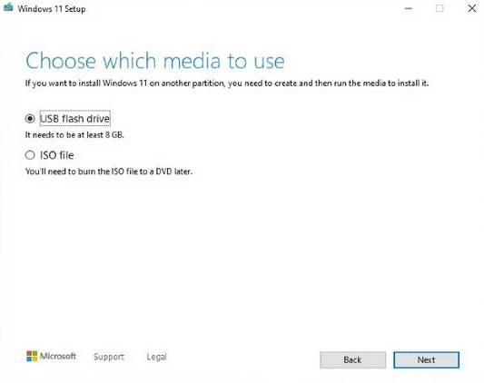
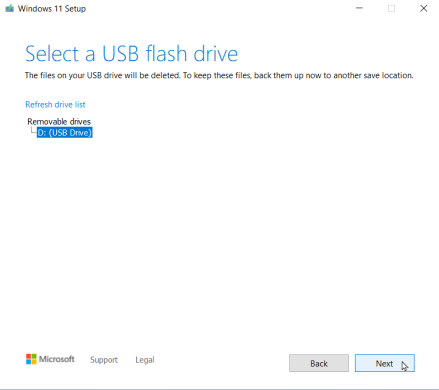
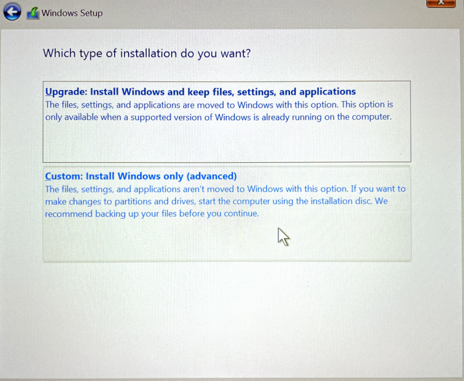
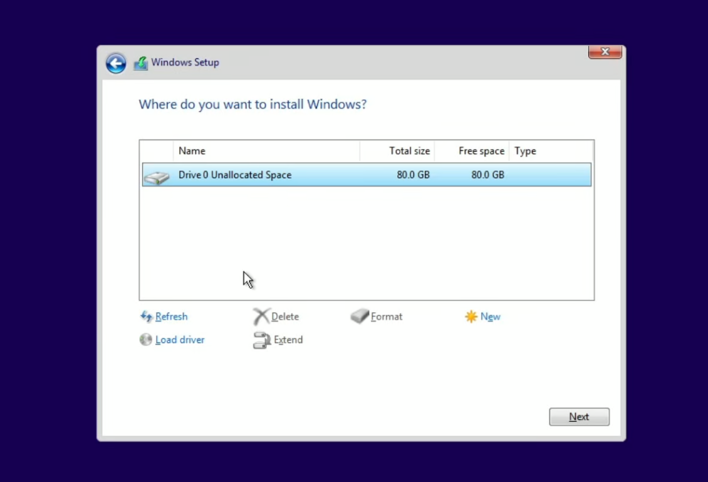

# Video Guide
<Quote>
  

    <iframe
      width="560"
      height="315"
      className="aspect-video w-full"
      src="https://www.youtube.com/embed/RaiKIoEpIUE?si=NXYHWPUrZ1_QopcO&rel=0"
      title="Video Guide on Installing Windows 11"
      allow="fullscreen; accelerometer; autoplay; clipboard-write; encrypted-media; gyroscope; picture-in-picture"
      aria-label="Video Guide on Installing Windows 11"
    ></iframe>
  

</Quote>

# Step 1 Create Installation Media:

1. Download Windows 11 Installation Media Tool from the link above. 

2. Insert your USB into your pc.

3. Follow the Instructions on the software. This will set the USB up to install Windows 11.

4. Make sure to select the correct USB that will be used for the installation of windows 11. Everything 
will be removed from the USB all data will be lost.

Once the Windows 11 setup software is complete it will let you know you can unplug installation media.

## Step 2 Enable TPM 2.0 in BIOS.

Restart your pc and press the BIOS key repeatedly until you enter the BIOS. The BIOS key will be displayed for 
a short second along with your motherboard logo when restarting.

Here is a list of the usual BIOS keys.

    1. Acer: F2 or DEL.
    2. ASUS: F2 or DEL.
    3. Dell: F2 or F12.
    4. HP: ESC or F10.
    5. Lenovo: F2 or Fn + F2.
    6. MSI: DEL.

Once in the BIOS you will need to enable TMP in your BIOS. This is required for windows 11 and it will not work 
unless you enable it.

You will need to either search around for the location of this setting for your specific motherboard BIOS or read 
the manual/instructions. Also you could Google around to find the location/settings to enable for windows 11. 

In this case I have an Asus motherboard.

1. Restart computer.
2. Get into BIOS using BIOS key.
3. Advanced settings.
4. TPM settings.
5. Enable TPM (enable firmware TPM)
    You may get a notice if you have an Intel CPU saying it will store key.

## Step 3 Specify BIOS Boot:

Once in the BIOS go to boot options and select the USB that you have configured with the Installation media. This should
have the higher priority of the boot selection.

Once you select the boot priority/order save the changes and restart your PC.

1. Go to Boot settings/priority.
2. Select the USB that you have plugged in as the highest boot priority.
3. Save All Settings and restart.
4. This will load you up into the windows 11 installation.

## Step 4 Install Windows:

Once the PC restarts with the Boot priority to the Installation media you will start the install of windows.

Follow the Instructions of windows and select the drive that you want to install windows 11 on.

<Quote>
Note: ALL DATA WILL BE LOST ON THE DRIVE THAT WILL BE SELECTED *
</Quote>

## Step 5 Select Drive to Install Windows 11 on:

## Step 6 Finish the Windows 11 install Questions:

There will be a list of questions that you need to complete such as email, preferences, and setup. After
Completing this you will have completed the Windows 11 Install. 

## Step 7 Enjoy Windows 11

Thank you for visiting my site!

Consider liking my Youtube Video and following me on Youtube/Github to show support.

